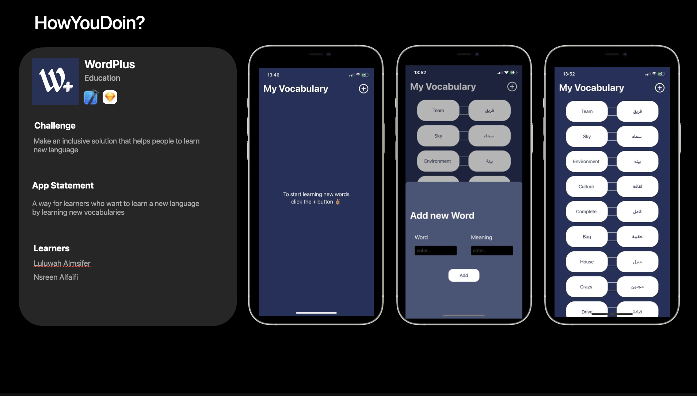

# WordPlus
an IOS App to lean new vocabularies.
This application was build for a one week challenge in Apple Developer Academy.

## Challenge Statement
Make an inclusive solution that helps people to learn new language.

## Solution Concept
A way for learners who want to learn a new language by learning new vocabularies.

## Technologies & Tools
- SwiftUI
- Realm
- Xcode

## App Demo

## Challenge Summary

## Languages 
- Arabic
- English

## Authors
- [@LulwahAlmisfer](https://github.com/LulwahAlmisfer)
- [@iNSREEN](https://github.com/iNSREEN)
